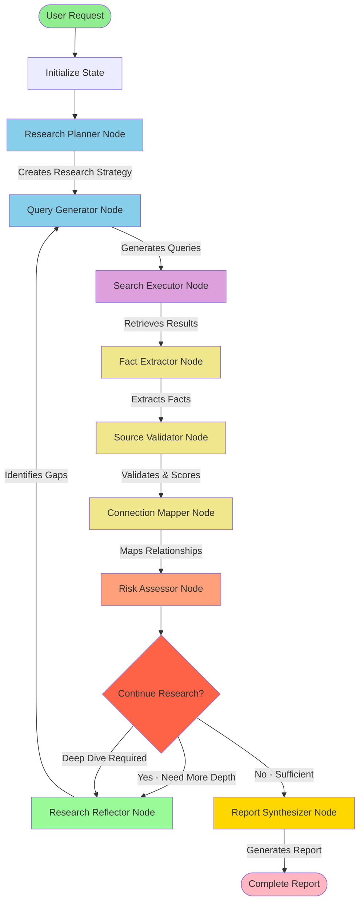

# 🏗️ Deep Research Agent - Architecture Documentation

## Table of Contents
1. [System Overview](#system-overview)
2. [LangGraph Workflow](#langgraph-workflow)
3. [Component Architecture](#component-architecture)
4. [Service Layer](#service-layer)
5. [Data Flow](#data-flow)
6. [Technology Stack](#technology-stack)

---

## System Overview

```
┌─────────────────────────────────────────────────────────────────────┐
│                     DEEP RESEARCH AGENT SYSTEM                      │
├─────────────────────────────────────────────────────────────────────┤
│                                                                     │
│  ┌──────────────┐         ┌──────────────┐        ┌─────────────┐ │
│  │   Frontend   │◄───────►│   Backend    │◄──────►│  External   │ │
│  │  (Streamlit) │  HTTP   │   (FastAPI)  │  APIs  │  Services   │ │
│  └──────────────┘         └──────────────┘        └─────────────┘ │
│         │                        │                        │         │
│    User Input              LangGraph               AI Models       │
│    Results Display         Workflow               Search APIs      │
│    Visualizations          State Mgmt            LangSmith         │
│                                                                     │
└─────────────────────────────────────────────────────────────────────┘
```

### High-Level Flow

```
User Input → FastAPI → LangGraph Workflow → AI Models + Search → 
State Management → Validation → Report Generation → Frontend Display
```

---

## LangGraph Workflow

### Visualize the Actual Graph

To see the ACTUAL compiled graph structure (not a diagram approximation):

```bash
python visualize_langgraph.py
```

This uses LangGraph's built-in visualization to show:
- The actual graph as compiled by `ResearchWorkflow`
- All nodes, edges, and conditional routing
- Accurate representation of the state machine

Output files:
- `architecture_diagrams/langgraph_ascii.txt` - ASCII art (always works)
- `architecture_diagrams/langgraph_mermaid.md` - Mermaid diagram
- `architecture_diagrams/langgraph_workflow.png` - PNG (requires graphviz)

### Research Graph Overview



### Node Responsibilities

| Node | Purpose | AI Model Used | Output |
|------|---------|---------------|--------|
| **Research Planner** | Creates multi-phase investigation strategy | Claude Opus | Research plan array |
| **Query Generator** | Generates targeted search queries | GPT-4 | Search queries list |
| **Search Executor** | Executes searches across multiple engines | N/A | Raw search results |
| **Fact Extractor** | Extracts structured facts from results | Claude Sonnet | Fact objects |
| **Source Validator** | Validates facts via cross-referencing | N/A (Service) | Verified facts |
| **Connection Mapper** | Maps entity relationships | GPT-4 | Connection objects |
| **Risk Assessor** | Identifies risks and patterns | Claude Opus | Risk flags |
| **Research Reflector** | Evaluates progress & identifies gaps | Gemini Pro | Knowledge gaps |
| **Report Synthesizer** | Generates final executive report | Claude Opus | Complete report |

---

## Component Architecture

### Backend Architecture

```
backend/
├── core/                           # Core business logic
│   ├── config.py                   # Configuration management
│   │   └── Settings (Pydantic)     # Environment variables
│   │
│   ├── state.py                    # State definitions
│   │   ├── ResearchState (TypedDict)
│   │   ├── Fact (Pydantic Model)
│   │   ├── RiskFlag (Pydantic Model)
│   │   ├── Connection (Pydantic Model)
│   │   └── ResearchReport (Pydantic Model)
│   │
│   ├── models.py                   # AI model coordination
│   │   └── MultiModelCoordinator
│   │       ├── GPT-4 (OpenAI)
│   │       ├── Claude Opus (Anthropic)
│   │       ├── Claude Sonnet (Anthropic)
│   │       └── Gemini Pro (Google)
│   │
│   ├── nodes.py                    # LangGraph nodes (8 nodes)
│   │   ├── BaseNode
│   │   ├── ResearchPlanner
│   │   ├── QueryGenerator
│   │   ├── DeepSearchExecutor
│   │   ├── FactExtractor
│   │   ├── SourceValidator
│   │   ├── ConnectionMapper
│   │   ├── RiskAssessor
│   │   ├── ResearchReflector
│   │   └── ReportSynthesizer
│   │
│   └── graph.py                    # Workflow orchestration
│       └── ResearchWorkflow
│           ├── _build_workflow()
│           ├── _should_continue_research()
│           └── conduct_research()
│
├── services/                       # External integrations
│   ├── search.py                   # Search engine integration
│   │   └── DeepSearchEngine
│   │       ├── Tavily API
│   │       └── DuckDuckGo API
│   │
│   ├── validation.py               # Source validation
│   │   ├── SourceValidator
│   │   │   ├── validate_facts()
│   │   │   ├── assess_source_credibility()
│   │   │   ├── detect_red_flags()
│   │   │   └── calculate_confidence()
│   │   └── ContentExtractor
│   │
│   └── langsmith_client.py         # Monitoring & tracing
│       └── LangSmithClient
│           ├── start_research_session()
│           ├── log_node_execution()
│           └── complete_research_session()
│
├── api/                            # REST API
│   └── routes.py                   # FastAPI endpoints
│       ├── POST /api/v1/research/start
│       ├── GET  /api/v1/research/status/{id}
│       ├── GET  /api/v1/research/report/{id}
│       ├── GET  /api/v1/research/sessions
│       └── DELETE /api/v1/research/{id}
│
└── main.py                         # Application entry point
    └── FastAPI app with middleware
```

### Frontend Architecture

```
frontend/
├── app.py                          # Main Streamlit application
│   ├── Main UI layout
│   ├── Tab management
│   └── State management
│
├── components/                     # UI components
│   ├── research_input.py           # Input form
│   │   ├── Target entity input
│   │   ├── Configuration options
│   │   └── Submit handler
│   │
│   ├── results_display.py          # Results display
│   │   ├── Live progress tracking
│   │   ├── Fact streaming
│   │   ├── Risk alerts
│   │   └── Report sections
│   │
│   ├── visualizations.py           # Charts & graphs
│   │   ├── create_network_graph()
│   │   ├── create_risk_chart()
│   │   ├── create_confidence_distribution()
│   │   ├── create_timeline_visualization()
│   │   ├── create_category_breakdown()
│   │   └── create_source_credibility_chart()
│   │
│   └── session_manager.py          # Session management
│       ├── List sessions
│       ├── View session
│       └── Cancel session
│
└── utils/
    └── api_client.py               # API wrapper
        └── ResearchAPIClient
            ├── start_research()
            ├── get_session_status()
            ├── get_research_report()
            ├── list_sessions()
            └── cancel_research()
```

---

## Service Layer

### AI Models Integration

```
┌─────────────────────────────────────────────────────────┐
│           Multi-Model Coordinator                       │
├─────────────────────────────────────────────────────────┤
│                                                         │
│  Task Assignment Strategy:                             │
│                                                         │
│  Planning          ──→  Claude Opus    (Best reasoning)│
│  Query Generation  ──→  GPT-4          (Reliable)      │
│  Fact Extraction   ──→  Claude Sonnet  (Cost-effective)│
│  Risk Assessment   ──→  Claude Opus    (Critical task) │
│  Reflection        ──→  Gemini Pro     (Diverse view)  │
│  Synthesis         ──→  Claude Opus    (Quality output)│
│                                                         │
│  Features:                                              │
│  • Automatic fallback on errors                        │
│  • Model-specific prompting                            │
│  • Cost optimization                                   │
│  • Performance monitoring                              │
│                                                         │
└─────────────────────────────────────────────────────────┘
```

### Search Integration

```
┌─────────────────────────────────────────────────────────┐
│              DeepSearchEngine                           │
├─────────────────────────────────────────────────────────┤
│                                                         │
│  Primary:    Tavily Search API                         │
│              • Optimized for AI research                │
│              • High-quality results                     │
│              • 3 results per query                      │
│                                                         │
│  Fallback:   DuckDuckGo Search                         │
│              • No API key required                      │
│              • Rate-limited                             │
│              • Broader coverage                         │
│                                                         │
│  Future:     Serper API                                │
│              • Google search results                    │
│              • Higher accuracy                          │
│              • (Optional integration)                   │
│                                                         │
│  Features:                                              │
│  • Parallel search execution                           │
│  • Result deduplication                                │
│  • Source metadata extraction                          │
│  • Rate limiting & retries                             │
│                                                         │
└─────────────────────────────────────────────────────────┘
```

### Validation Service

```
┌─────────────────────────────────────────────────────────┐
│           SourceValidator Service                       │
├─────────────────────────────────────────────────────────┤
│                                                         │
│  Source Credibility Database:                          │
│  • 90+ trusted domains                                 │
│  • Government sources (.gov) → 1.0                     │
│  • Educational (.edu)        → 0.95                    │
│  • Major news outlets        → 0.85-0.9                │
│  • Financial/Legal databases → 0.8-1.0                 │
│  • Unknown sources           → 0.3-0.5                 │
│                                                         │
│  Validation Pipeline:                                   │
│  1. Assess source credibility                          │
│  2. Cross-reference with other sources                 │
│  3. Check for contradictions                           │
│  4. Calculate confidence scores                        │
│  5. Detect red flags                                   │
│  6. Assess date relevance                              │
│                                                         │
│  Red Flag Detection:                                    │
│  • 20+ risk keywords                                   │
│  • Context extraction                                  │
│  • Severity classification                             │
│  • Evidence aggregation                                │
│                                                         │
└─────────────────────────────────────────────────────────┘
```

### LangSmith Integration

```
┌─────────────────────────────────────────────────────────┐
│          LangSmith Monitoring & Tracing                 │
├─────────────────────────────────────────────────────────┤
│                                                         │
│  Automatic Tracing:                                     │
│  • All LangChain/LangGraph operations                  │
│  • AI model calls                                      │
│  • Tool executions                                     │
│  • Error tracking                                      │
│                                                         │
│  Custom Events:                                         │
│  • Research session start/end                          │
│  • Node execution logging                              │
│  • Performance metrics                                 │
│  • Cost tracking                                       │
│                                                         │
│  Dashboard Features:                                    │
│  • Real-time execution traces                          │
│  • Performance analytics                               │
│  • Cost breakdown                                      │
│  • Error debugging                                     │
│  • Dataset management                                  │
│                                                         │
└─────────────────────────────────────────────────────────┘
```

---

## Data Flow

### Complete Research Flow

```
1. USER INPUT
   ↓
   "John Doe - CEO of TechCorp"
   max_depth: 3
   
2. INITIALIZATION
   ↓
   Create ResearchState
   {
     target_entity: "John Doe - CEO of TechCorp"
     research_depth: 0
     research_plan: []
     ...
   }
   
3. RESEARCH PLANNER (Claude Opus)
   ↓
   Analyzes target → Creates strategic plan
   research_plan: [
     "Biographical verification",
     "Professional credentials",
     "Financial connections",
     "Legal history"
   ]
   
4. QUERY GENERATOR (GPT-4)
   ↓
   Generates specific queries
   queries: [
     "John Doe CEO TechCorp LinkedIn",
     "John Doe TechCorp SEC filings",
     "John Doe litigation history"
   ]
   
5. SEARCH EXECUTOR
   ↓
   Executes searches → Retrieves results
   raw_results: [
     { title: "...", content: "...", url: "..." },
     ...
   ]
   
6. FACT EXTRACTOR (Claude Sonnet)
   ↓
   Extracts structured facts
   extracted_facts: [
     {
       content: "John Doe is CEO of TechCorp since 2020",
       category: "professional",
       confidence: 0.9,
       sources: ["https://techcorp.com/about"]
     },
     ...
   ]
   
7. SOURCE VALIDATOR (Service)
   ↓
   Validates & scores facts
   verified_facts: [
     {
       ...fact,
       verified: true,
       confidence: 0.92,  # Updated
       supporting_sources: [...]
     }
   ]
   
8. CONNECTION MAPPER (GPT-4)
   ↓
   Maps relationships
   connections: [
     {
       source: "John Doe",
       target: "TechCorp",
       relationship: "professional",
       strength: 0.95
     }
   ]
   
9. RISK ASSESSOR (Claude Opus)
   ↓
   Identifies risks
   risks_flagged: [
     {
       type: "legal",
       severity: "medium",
       description: "Pending litigation...",
       confidence: 0.75
     }
   ]
   
10. DECISION POINT
    ↓
    research_depth < max_depth? → YES
    
11. RESEARCH REFLECTOR (Gemini Pro)
    ↓
    Identifies gaps
    knowledge_gaps: [
      "Missing information about previous employers",
      "Unclear board memberships"
    ]
    ↓
    LOOP BACK to Query Generator (with new focus)
    
12. [After max_depth reached]
    ↓
    REPORT SYNTHESIZER (Claude Opus)
    ↓
    Generates executive summary
    final_report: {
      executive_summary: "...",
      key_findings: [...],
      risk_assessment: {...},
      connection_network: [...],
      confidence_scores: {...}
    }
    
13. FRONTEND DISPLAY
    ↓
    • Executive summary
    • Key findings by category
    • Risk assessment with severity
    • Connection network graph
    • Metadata & confidence scores
```

---

## Technology Stack

### Backend Stack

```yaml
Framework:
  - FastAPI: REST API framework
  - LangGraph: Workflow orchestration
  - LangChain: AI model integration

AI Models:
  - OpenAI: GPT-4
  - Anthropic: Claude Opus, Claude Sonnet
  - Google: Gemini Pro

Search & Data:
  - Tavily: Primary search API
  - DuckDuckGo: Fallback search
  - BeautifulSoup4: HTML parsing (future)

Data & Validation:
  - Pydantic: Data validation & settings
  - NetworkX: Graph/network analysis

Monitoring:
  - LangSmith: Tracing & debugging
  - (Future: Sentry for error tracking)

Server:
  - Uvicorn: ASGI server
  - Python 3.10+
```

### Frontend Stack

```yaml
Framework:
  - Streamlit: Web application framework

Visualization:
  - Plotly: Interactive charts & graphs
  - NetworkX: Network graph layouts
  - Matplotlib: Additional plotting

Data Processing:
  - Pandas: Data manipulation
  - NumPy: Numerical operations

HTTP:
  - Requests: API client
```

### Development & Testing

```yaml
Testing:
  - Pytest: Test framework
  - Pytest-asyncio: Async test support
  - Pytest-cov: Coverage reporting

Code Quality:
  - Flake8: Linting
  - Black: Code formatting
  - MyPy: Type checking

Dependencies:
  - pip: Package management
  - venv: Virtual environments
```

---

## State Management

### ResearchState Schema

```python
ResearchState = {
    # Core Data
    "target_entity": str,              # Entity being researched
    "research_plan": List[str],        # Strategic plan
    "search_queries": List[str],       # All queries generated
    "raw_search_results": List[Dict],  # Search results
    "extracted_facts": List[Dict],     # Extracted facts
    "verified_facts": List[Dict],      # Validated facts
    "risks_flagged": List[Dict],       # Identified risks
    "connections": List[Dict],         # Entity relationships
    "confidence_scores": Dict,         # Confidence metrics
    
    # Control Flow
    "research_depth": int,             # Current iteration
    "max_depth": int,                  # Maximum iterations
    "next_step": str,                  # Next action
    "knowledge_gaps": List[str],       # Identified gaps
    "current_focus": str,              # Current research focus
    
    # Meta
    "model_decisions": Dict,           # Model choices/reasoning
    "research_session_id": str,        # Unique session ID
    "start_time": str,                 # Start timestamp
    "langsmith_session_id": str,       # LangSmith trace ID
}
```

### State Transitions

```
Initial State
    ↓ Research Planner
State + research_plan
    ↓ Query Generator
State + search_queries
    ↓ Search Executor
State + raw_search_results
    ↓ Fact Extractor
State + extracted_facts
    ↓ Source Validator
State + verified_facts + confidence_scores
    ↓ Connection Mapper
State + connections
    ↓ Risk Assessor
State + risks_flagged
    ↓ Research Reflector
State + knowledge_gaps + research_depth++
    ↓ [Loop or Finalize]
Final State + final_report
```

---

## API Endpoints

### Research Endpoints

```
POST /api/v1/research/start
├─ Body: { target_entity, max_depth, research_focus }
└─ Returns: { session_id, status, message }

GET /api/v1/research/status/{session_id}
└─ Returns: { session_id, status, progress, findings_count, risks_identified }

GET /api/v1/research/report/{session_id}
└─ Returns: Complete ResearchReport object

GET /api/v1/research/sessions
└─ Returns: [ { session_id, target_entity, status, progress }, ... ]

DELETE /api/v1/research/{session_id}
└─ Returns: { message: "Research session cancelled" }
```

### System Endpoints

```
GET /
└─ Returns: API info & version

GET /health
└─ Returns: System health status

GET /docs
└─ OpenAPI/Swagger documentation

GET /redoc
└─ ReDoc documentation
```

---

## Performance Characteristics

### Timing (Typical)

```
Depth 1: 5-8 minutes
Depth 2: 10-15 minutes
Depth 3: 15-25 minutes
Depth 4: 25-35 minutes
Depth 5: 35-50 minutes
```

### API Calls (Depth 3)

```
Search API: 15-20 calls
OpenAI:     10-15 calls
Anthropic:  15-20 calls
Google:     3-5 calls
Total:      43-60 API calls
```

### Cost (Depth 3)

```
OpenAI (GPT-4):     $0.50 - $1.00
Anthropic (Claude): $0.80 - $1.50
Google (Gemini):    $0.10 - $0.20
Search APIs:        $0.05 - $0.30
Total:              $1.45 - $3.00
```

---

## Security & Configuration

### Environment Variables

```bash
# AI Models (Required)
OPENAI_API_KEY=sk-...
ANTHROPIC_API_KEY=sk-ant-...
GOOGLE_API_KEY=...

# Search (Required)
TAVILY_API_KEY=tvly-...
SERPER_API_KEY=...  # Optional

# Monitoring (Required for production)
LANGSMITH_API_KEY=ls__...
LANGCHAIN_TRACING_V2=true

# Application
DEBUG=true
LOG_LEVEL=INFO
MAX_RESEARCH_DEPTH=3
```

### Security Best Practices

- ✅ API keys in environment variables (never in code)
- ✅ CORS properly configured
- ✅ Input validation via Pydantic
- ✅ Rate limiting on endpoints
- ✅ Error handling & logging
- ⚠️ TODO: Authentication/authorization
- ⚠️ TODO: API key rotation
- ⚠️ TODO: Request signing

---

## Scalability Considerations

### Current Limitations

- Single-server deployment
- In-memory session storage
- Synchronous search execution
- No caching layer

### Scaling Path

1. **Database Integration**
   - PostgreSQL for session persistence
   - Redis for caching

2. **Async Optimization**
   - Parallel search execution
   - Concurrent fact extraction

3. **Queue System**
   - Celery for background jobs
   - RabbitMQ/Redis as broker

4. **Containerization**
   - Docker for deployment
   - Kubernetes for orchestration

5. **Load Balancing**
   - Multiple backend instances
   - Nginx/Traefik for routing

---

## Monitoring & Observability

### LangSmith Dashboard

```
Real-time Monitoring:
├─ Execution traces for each research session
├─ Node-by-node performance metrics
├─ AI model call tracking & costs
├─ Error rates & debugging info
└─ Custom event logging

Analytics:
├─ Average research duration
├─ Cost per research session
├─ Success/failure rates
├─ Model performance comparison
└─ Query effectiveness metrics
```

### Application Logs

```
Location: stdout (development)
Format: Structured JSON (production)

Log Levels:
DEBUG:   Detailed execution flow
INFO:    Major milestones & events
WARNING: Recoverable issues
ERROR:   Failed operations
```

---

## Future Architecture Enhancements

### Short-term
- [ ] Redis caching layer
- [ ] WebSocket for real-time updates
- [ ] PDF report generation
- [ ] Email notifications
- [ ] Enhanced error tracking (Sentry)

### Medium-term
- [ ] Database persistence (PostgreSQL)
- [ ] User authentication & authorization
- [ ] API rate limiting per user
- [ ] Batch processing capabilities
- [ ] Advanced web scraping (BeautifulSoup)

### Long-term
- [ ] Multi-tenancy support
- [ ] Custom AI model fine-tuning
- [ ] Human-in-the-loop workflows
- [ ] Automated prompt optimization
- [ ] ML-based source credibility scoring
- [ ] Advanced NLP for entity extraction
- [ ] Knowledge graph construction

---

## Summary

The Deep Research Agent uses a **sophisticated LangGraph workflow** with **8 specialized nodes**, **4 AI models**, and **multiple external services** to conduct comprehensive due diligence research. The architecture is designed for:

- ✅ **Modularity**: Each component has single responsibility
- ✅ **Scalability**: Clear path to horizontal scaling
- ✅ **Maintainability**: Clean separation of concerns
- ✅ **Observability**: Full tracing via LangSmith
- ✅ **Reliability**: Error handling & fallbacks throughout
- ✅ **Extensibility**: Easy to add new nodes, models, or services

The system successfully orchestrates complex multi-step research workflows while maintaining state consistency, providing real-time monitoring, and delivering high-quality, validated research reports.

