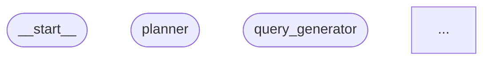

# 📊 Graph Visualization Guide

## Why Use LangGraph's Built-in Visualization?

Instead of manually drawing diagrams, LangGraph provides built-in visualization that shows the **ACTUAL compiled graph structure**:

✅ **Accurate** - Shows exactly what your code creates
✅ **Automatic** - Updates when you change the graph
✅ **Standard** - Uses LangGraph's official methods
✅ **Multiple formats** - ASCII, Mermaid, PNG

---

## Quick Start

```bash
python visualize_langgraph.py
```

**Output:**
```
architecture_diagrams/
├── langgraph_ascii.txt      # ASCII art (always works)
├── langgraph_mermaid.md     # Mermaid diagram
└── langgraph_workflow.png   # PNG image (optional)
```

---

## Visualization Methods

### 1. ASCII Diagram (Always Works)

```python
from core.graph import ResearchWorkflow

workflow = ResearchWorkflow()
ascii_diagram = workflow.graph.get_graph().draw_ascii()
print(ascii_diagram)
```

**Output example:**
```
           +-----------+              
           | __start__ |              
           +-----------+              
                 *                    
                 *                    
                 *                    
          +------------+              
          |  planner   |              
          +------------+              
                 *                    
                 *                    
           +----------+               
           | query_   |               
           | generator|               
           +----------+               
                ...
```

Shows:
- All nodes
- All edges
- Entry and exit points
- Conditional branches

---

### 2. Mermaid Diagram (Best for Documentation)

```python
mermaid_code = workflow.graph.get_graph().draw_mermaid()
```

**Mermaid code** can be:
- Viewed at https://mermaid.live
- Rendered in GitHub markdown
- Embedded in documentation
- Used with VS Code Mermaid extension

**Example output:**


---

### 3. PNG Image (Requires Graphviz)

```python
png_data = workflow.graph.get_graph().draw_mermaid_png()

with open("graph.png", "wb") as f:
    f.write(png_data)
```

**Requirements:**
```bash
# Option 1: pip (may have issues on Windows)
pip install pygraphviz

# Option 2: conda (recommended for Windows)
conda install -c conda-forge pygraphviz

# On Ubuntu/Debian
sudo apt-get install graphviz graphviz-dev
pip install pygraphviz

# On macOS
brew install graphviz
pip install pygraphviz
```

---

## What the Graph Shows

### Nodes in Your Workflow

```
1. __start__           - Entry point
2. planner             - ResearchPlanner
3. query_generator     - QueryGenerator
4. search_executor     - DeepSearchExecutor
5. fact_extractor      - FactExtractor
6. source_validator    - SourceValidator
7. connection_mapper   - ConnectionMapper
8. risk_assessor       - RiskAssessor
9. research_reflector  - ResearchReflector
10. report_synthesizer - ReportSynthesizer
11. __end__            - Exit point
```

### Edge Types

**Regular Edges** (A → B):
```python
workflow.add_edge("planner", "query_generator")
```
Shows fixed transitions between nodes.

**Conditional Edges** (A → ?):
```python
workflow.add_conditional_edges(
    "risk_assessor",
    _should_continue_research,
    {
        "continue": "research_reflector",
        "deep_dive": "research_reflector",
        "finalize": "report_synthesizer"
    }
)
```
Shows decision points with multiple possible paths.

**Loops** (A → B → ... → A):
```python
workflow.add_edge("research_reflector", "query_generator")
```
Shows iterative research cycles.

---

## Understanding Your Graph

### The Main Flow

```
Start
  ↓
Research Planner (creates strategy)
  ↓
Query Generator (creates queries)
  ↓
Search Executor (searches web)
  ↓
Fact Extractor (extracts facts)
  ↓
Source Validator (validates facts)
  ↓
Connection Mapper (maps relationships)
  ↓
Risk Assessor (identifies risks)
  ↓
[DECISION POINT]
  ├→ Continue/Deep Dive → Research Reflector → [LOOP BACK to Query Generator]
  └→ Finalize → Report Synthesizer → End
```

### Why This Matters

1. **Debugging** - See where the flow gets stuck
2. **Optimization** - Identify bottlenecks
3. **Understanding** - Visualize the state machine
4. **Documentation** - Share with team
5. **Changes** - Verify graph modifications

---

## Comparing Approaches

### ❌ Manual Diagram (Old Way)

```python
# visualize_architecture.py (old)
def create_langgraph_workflow():
    G = nx.DiGraph()
    G.add_node("Planner")
    G.add_node("QueryGen")
    # ... manually define everything
```

**Problems:**
- Gets out of sync with code
- Doesn't show conditional edges accurately
- Manual updates needed
- Not the "true" graph

### ✅ LangGraph Visualization (Correct Way)

```python
# visualize_langgraph.py (new)
workflow = ResearchWorkflow()
ascii = workflow.graph.get_graph().draw_ascii()
```

**Benefits:**
- Always accurate
- Shows actual compiled structure
- Includes all conditional logic
- Automatically updates

---

## Advanced Usage

### Get Graph Metadata

```python
graph_info = workflow.graph.get_graph()

# All nodes
print(f"Nodes: {graph_info.nodes}")

# All edges
print(f"Edges: {graph_info.edges}")

# Entry points
print(f"Entry points: {graph_info._entry_point}")
```

### Programmatic Analysis

```python
# Find nodes with no incoming edges (entry nodes)
entry_nodes = [
    node for node in graph_info.nodes
    if not any(edge.target == node for edge in graph_info.edges)
]

# Find nodes with no outgoing edges (exit nodes)
exit_nodes = [
    node for node in graph_info.nodes
    if not any(edge.source == node for edge in graph_info.edges)
]

# Find conditional branches
conditional_nodes = [
    edge.source for edge in graph_info.edges
    if hasattr(edge, 'conditional') and edge.conditional
]
```

### Custom Visualization

```python
# Get the graph and customize
from langgraph.graph import Graph

graph = workflow.graph.get_graph()

# Modify Mermaid output
mermaid = graph.draw_mermaid()
custom_mermaid = mermaid.replace(
    "graph TD",
    "graph LR"  # Left-to-right instead of top-down
)
```

---

## Integration with Documentation

### In README.md

````markdown
## Architecture

Our research workflow:

```mermaid
[paste output from draw_mermaid() here]
```
````

### In Jupyter Notebooks

```python
from IPython.display import Image, display

workflow = ResearchWorkflow()
png = workflow.graph.get_graph().draw_mermaid_png()
display(Image(png))
```

### In Web Dashboards

```python
import streamlit as st

# In your Streamlit app
st.subheader("Research Workflow")
mermaid_code = workflow.graph.get_graph().draw_mermaid()
st.code(mermaid_code, language="mermaid")
```

---

## Troubleshooting

### Issue: "Module 'graphviz' not found"

**Solution:** PNG generation is optional. Use ASCII or Mermaid instead.

```bash
# ASCII always works
python visualize_langgraph.py
# Check langgraph_ascii.txt
```

### Issue: Mermaid diagram too large

**Solution:** Use Mermaid Live with zoom:
1. Copy mermaid code
2. Go to https://mermaid.live
3. Paste code
4. Use zoom controls

### Issue: Want horizontal layout

**Edit the Mermaid code:**
```mermaid
graph LR;  # Left-Right instead of TD (Top-Down)
```

---

## Best Practices

### 1. Generate After Changes

```bash
# After modifying graph.py
python visualize_langgraph.py
# Verify changes are correct
```

### 2. Commit Visualizations

```bash
git add architecture_diagrams/
git commit -m "Update graph visualization"
```

### 3. Use in Code Reviews

- Include graph visualization in PRs
- Helps reviewers understand changes
- Documents workflow modifications

### 4. Update Documentation

Keep diagrams in README/docs in sync:
```bash
python visualize_langgraph.py
# Copy mermaid output to README.md
```

---

## Summary

✅ **Use `visualize_langgraph.py`** for actual graph structure
✅ **ASCII always works** - No dependencies needed
✅ **Mermaid for docs** - Best for sharing/documentation
✅ **PNG optional** - Nice but requires graphviz

❌ **Don't hardcode diagrams** - They get out of sync
❌ **Don't manually create graphs** - Use LangGraph's methods

**Quick command:**
```bash
python visualize_langgraph.py && cat architecture_diagrams/langgraph_ascii.txt
```

This shows your exact graph structure instantly! 🎉

