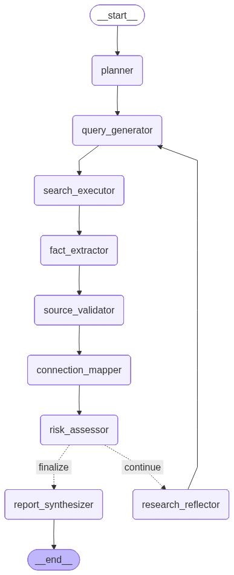

# Deep Research Agent

> **AI-Powered Due Diligence & Investigative Research System**

A multi-agent research system built with LangGraph that conducts comprehensive due diligence investigations on individuals and organizations. The system orchestrates multiple AI models, search engines, and validation services to uncover facts, assess risks, and generate detailed research reports.


---

## Table of Contents

- [Overview](#overview)
- [Key Features](#key-features)
- [Architecture](#architecture)
- [Technology Stack](#technology-stack)
- [Installation](#installation)
- [Quick Start](#quick-start)
- [Usage](#usage)
- [LangGraph Workflow](#langgraph-workflow)
- [API Documentation](#api-documentation)
- [Configuration](#configuration)
- [Project Structure](#project-structure)
- [Contributing](#contributing)
- [License](#license)

---

## 🎯 Overview

The Deep Research Agent is an advanced AI system designed for:

- **Due Diligence Research**: Comprehensive background checks on individuals and organizations
- **Risk Assessment**: Automated identification of legal, financial, and reputational risks
- **Fact Verification**: Multi-source validation and credibility scoring
- **Connection Mapping**: Network analysis of relationships and associations
- **Report Generation**: Executive-level research reports with confidence metrics

### What Makes It Unique?

1. **Iterative Deep Research**: Automatically identifies knowledge gaps and conducts follow-up investigations
2. **Source Validation**: Cross-references facts across 90+ trusted domains with credibility scoring
3. **LangGraph Workflow**: State-machine-based research process with conditional routing
---

## Key Features

### Multi-Agent Research System
- **9 Specialized Nodes**: Each optimized for specific research tasks
- **Conditional Routing**: Intelligent decision-making on when to continue or finalize research
- **Iterative Refinement**: Automatically deepens investigation based on findings

### Advanced Search Capabilities
- **Multi-Engine Search**: Tavily API (primary) + DuckDuckGo (fallback)
- **Targeted Query Generation**: AI-powered search query optimization
- **Deduplication**: Intelligent filtering of redundant information

### Fact Verification & Validation
- **90+ Trusted Domains**: Government, educational, news, and financial sources
- **Confidence Scoring**: 0.0-1.0 scale based on source credibility
- **Cross-Referencing**: Multi-source fact validation
- **Red Flag Detection**: 20+ risk keywords with context extraction

### Comprehensive Reporting
- **Executive Summaries**: High-level findings and risk assessment
- **Categorized Facts**: Organized by biographical, financial, legal, etc.
- **Network Graphs**: Visual relationship mapping
- **Confidence Metrics**: Transparency in research quality

### Interactive Frontend
- **Real-time Progress**: Live updates during research execution
- **Rich Visualizations**: Network graphs, risk charts, confidence distributions
- **Session Management**: Track and review multiple research sessions
- **PDF Export**: Professional report generation

---

## 🏗️ Architecture

### System Overview

```
┌─────────────────────────────────────────────────────────────┐
│                  DEEP RESEARCH AGENT SYSTEM                 │
├─────────────────────────────────────────────────────────────┤
│                                                             │
│  ┌──────────────┐      ┌──────────────┐   ┌─────────────┐ │
│  │   Frontend   │◄────►│   Backend    │◄─►│  External   │ │
│  │  (Streamlit) │ HTTP │   (FastAPI)  │API│  Services   │ │
│  └──────────────┘      └──────────────┘   └─────────────┘ │
│         │                     │                    │        │
│    User Input           LangGraph           AI Models       │
│    Visualizations       Workflow           Search APIs      │
│    Reports              State Mgmt         LangSmith        │
│                                                             │
└─────────────────────────────────────────────────────────────┘
```

### LangGraph Research Flow



The system uses a sophisticated state machine with 9 nodes:

1. **Research Planner** → Creates strategic investigation plan
2. **Query Generator** → Generates targeted search queries
3. **Search Executor** → Executes multi-engine searches
4. **Fact Extractor** → Extracts structured facts from results
5. **Source Validator** → Validates facts and assesses credibility
6. **Connection Mapper** → Maps entity relationships
7. **Risk Assessor** → Identifies risks and red flags
8. **Research Reflector** → Evaluates progress and identifies gaps
9. **Report Synthesizer** → Generates final executive report

For detailed architecture documentation, see [ARCHITECTURE.md](ARCHITECTURE.md).

---

## 🛠️ Technology Stack

### Backend
- **Framework**: FastAPI, LangGraph, LangChain
- **AI Models**: OpenAI GPT-4, Anthropic Claude (Opus/Sonnet), Google Gemini Pro
- **Search**: Tavily API, DuckDuckGo
- **Validation**: Pydantic, NetworkX
- **Monitoring**: LangSmith
- **Server**: Uvicorn (ASGI)

### Frontend
- **Framework**: Streamlit
- **Visualization**: Plotly, NetworkX, Matplotlib
- **Data**: Pandas, NumPy
- **Export**: ReportLab (PDF generation)

### Development
- **Testing**: Pytest, Pytest-asyncio
- **Quality**: Flake8, Black, MyPy
- **Environment**: Python 3.10+

---

## 📦 Installation

### Prerequisites

- Python 3.10 or higher
- pip package manager
- Virtual environment (recommended)

### Step 1: Clone Repository

```bash
git clone <repository-url>
cd deep_research_agent
```

### Step 2: Create Virtual Environment

```bash
python -m venv venv

# Windows
venv\Scripts\activate

# macOS/Linux
source venv/bin/activate
```

### Step 3: Install Dependencies

```bash
pip install -r requirements.txt
```

### Step 4: Configure Environment

```bash
# Copy environment template
cp env.template .env

---

## 🚀 Quick Start

### Start Backend Server

```bash
cd backend
python main.py
```

Backend will run on `http://localhost:8000`

### Start Frontend Application

Open a new terminal:

```bash
cd frontend
streamlit run app.py
```

Frontend will open at `http://localhost:8501`

### Run Your First Research

1. Open `http://localhost:8501` in your browser
2. Enter a target entity (e.g., "Elon Musk" or "Tesla Inc")
3. Configure research depth (1-5, recommended: 3)
4. Click "Start Research"
5. Watch real-time progress and results

---
