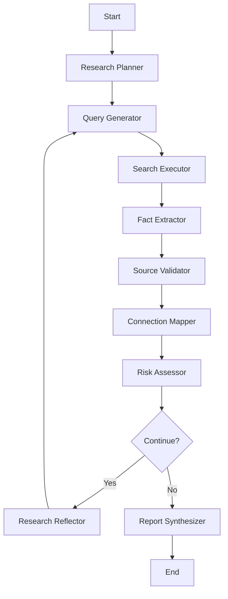

# 🔍 Deep Research AI Agent

An autonomous AI-powered research agent for comprehensive due diligence investigations. Leverages multiple AI models, search engines, and intelligent workflows to uncover hidden connections, assess risks, and provide strategic insights.


## 📋 Table of Contents

- [Overview](#overview)
- [Key Features](#key-features)
- [Architecture](#architecture)
- [Installation](#installation)
- [Configuration](#configuration)
- [Usage](#usage)
- [Evaluation](#evaluation)
- [API Documentation](#api-documentation)
- [Development](#development)
- [Troubleshooting](#troubleshooting)
- [Contributing](#contributing)

## 🎯 Overview

Deep Research Agent is designed for professional due diligence, risk assessment, and investigative research. It combines:

- **Multi-Model AI**: Orchestrates GPT-4, Claude Opus/Sonnet, and Gemini for different research tasks
- **Intelligent Search**: Progressive search strategy that builds upon discoveries
- **Fact Verification**: Cross-references multiple sources with confidence scoring
- **Risk Assessment**: Automated pattern recognition and risk flagging
- **Connection Mapping**: Traces relationships between entities and organizations
- **LangGraph Workflows**: Sophisticated state machine for research orchestration

## ✨ Key Features

### Core Capabilities

- ✅ **Autonomous Research**: Conducts multi-phase investigations with minimal human intervention
- ✅ **Deep Fact Extraction**: Identifies biographical, professional, financial, and legal information
- ✅ **Risk Pattern Recognition**: Flags potential red flags, inconsistencies, and concerning associations
- ✅ **Connection Mapping**: Builds relationship networks between entities
- ✅ **Source Validation**: Implements confidence scoring and cross-referencing
- ✅ **Real-time Monitoring**: LangSmith integration for execution tracking
- ✅ **Interactive Dashboard**: Streamlit frontend for visualization and control

### Technical Features

- 🤖 **4 AI Models**: GPT-4, Claude Opus, Claude Sonnet, Gemini Pro
- 🔍 **Multiple Search Engines**: Tavily, DuckDuckGo, Serper
- 📊 **Advanced Visualizations**: Network graphs, risk charts, timelines
- 🔄 **Consecutive Search Strategy**: Dynamic query refinement based on findings
- 📝 **Comprehensive Reports**: Executive summaries with evidence and citations
- ⚡ **Async Architecture**: Fast, scalable processing
- 🛡️ **Error Handling**: Robust fallbacks and retry mechanisms

## 🏗️ Architecture

### Visualize the Actual Graph

```bash
# Visualize the actual LangGraph workflow
python visualize_langgraph.py

# This generates:
# - ASCII diagram (always works)
# - Mermaid diagram (view at mermaid.live)  
# - PNG image (if graphviz installed)
```

### Project Structure

```
deep_research_agent/
├── backend/
│   ├── core/
│   │   ├── config.py          # Configuration management
│   │   ├── state.py           # Research state definitions
│   │   ├── models.py          # Multi-model coordinator
│   │   ├── nodes.py           # LangGraph node implementations
│   │   └── graph.py           # Workflow orchestration
│   ├── services/
│   │   ├── search.py          # Multi-engine search
│   │   ├── validation.py      # Source validation & scoring
│   │   └── langsmith_client.py # Monitoring & tracing
│   ├── api/
│   │   └── routes.py          # FastAPI endpoints
│   └── main.py                # Application entry point
├── frontend/
│   ├── components/
│   │   ├── research_input.py  # Input form component
│   │   ├── results_display.py # Results visualization
│   │   ├── visualizations.py  # Charts and graphs
│   │   └── session_manager.py # Session management
│   ├── utils/
│   │   └── api_client.py      # API client wrapper
│   └── app.py                 # Streamlit application
├── evaluation/
│   ├── timothy_overturf.py    # Test persona 1 (High difficulty)
│   ├── maria_rodriguez.py     # Test persona 2 (Medium difficulty)
│   ├── blackstone_capital.py  # Test persona 3 (Very high difficulty)
│   └── run_evaluation.py      # Evaluation runner
└── tests/
    ├── unit/                   # Unit tests
    ├── integration/            # Integration tests
    └── e2e/                    # End-to-end tests
```

### LangGraph Workflow



## 🚀 Installation

### Prerequisites

- Python 3.10 or higher
- pip or conda
- API keys for AI models and search engines
- (Optional) Redis for caching
- (Optional) PostgreSQL for persistent storage

### Step 1: Clone Repository

```bash
git clone https://github.com/yourusername/deep_research_agent.git
cd deep_research_agent
```

### Step 2: Create Virtual Environment

```bash
# Using venv
python -m venv venv
source venv/bin/activate  # On Windows: venv\Scripts\activate

# Or using conda
conda create -n research-agent python=3.10
conda activate research-agent
```

### Step 3: Install Dependencies

```bash
pip install -r requirements.txt
```

### Step 4: Configure Environment

```bash
# Copy template
cp env.template .env

# Edit .env with your API keys
nano .env  # or your preferred editor
```

## ⚙️ Configuration

### Required API Keys

1. **OpenAI** (GPT-4): https://platform.openai.com/api-keys
2. **Anthropic** (Claude): https://console.anthropic.com/account/keys
3. **Google AI** (Gemini): https://makersuite.google.com/app/apikey
4. **Tavily Search**: https://tavily.com (Free tier available)
5. **LangSmith**: https://smith.langchain.com (For monitoring)

### Optional Keys

- **Serper**: https://serper.dev (Alternative search)
- **Sentry**: For error tracking

### Environment Variables

```bash
# AI Models
OPENAI_API_KEY=sk-...
ANTHROPIC_API_KEY=sk-ant-...
GOOGLE_API_KEY=...

# Search
TAVILY_API_KEY=tvly-...
SERPER_API_KEY=...  # Optional

# LangSmith (Monitoring)
LANGSMITH_API_KEY=ls__...
LANGSMITH_PROJECT=deep-research-agent
LANGCHAIN_TRACING_V2=true

# Application
DEBUG=true
LOG_LEVEL=INFO
MAX_RESEARCH_DEPTH=3
```

## 📖 Usage

### Starting the Backend

```bash
cd backend
python main.py
```

The API will be available at `http://localhost:8000`

- API Docs: http://localhost:8000/docs
- Health Check: http://localhost:8000/health

### Starting the Frontend

```bash
cd frontend
streamlit run app.py
```

The UI will open at `http://localhost:8501`

### Basic Usage Example

#### Via UI

1. Navigate to http://localhost:8501
2. Enter target entity (e.g., "John Smith - CEO of TechCorp")
3. Configure research depth and focus areas
4. Click "Start Research"
5. Monitor progress in "Live Results" tab
6. Review complete report when finished

#### Via API

```python
import requests

# Start research
response = requests.post(
    "http://localhost:8000/api/v1/research/start",
    json={
        "target_entity": "John Smith - CEO of TechCorp",
        "max_depth": 3,
        "research_focus": "comprehensive"
    }
)

session_id = response.json()["session_id"]

# Check status
status = requests.get(
    f"http://localhost:8000/api/v1/research/status/{session_id}"
)

# Get report (when completed)
report = requests.get(
    f"http://localhost:8000/api/v1/research/report/{session_id}"
)
```

### Advanced Usage

#### Custom Research Focus

```python
{
    "target_entity": "Maria Rodriguez",
    "max_depth": 4,
    "research_focus": "legal",
    "additional_context": {
        "focus_areas": ["Legal", "Financial", "Professional"],
        "known_associations": ["VisionTech AI", "ByteTech"],
        "time_range": "2018-2023"
    }
}
```

#### Programmatic Integration

```python
from backend.core.graph import ResearchWorkflow

workflow = ResearchWorkflow()

result = await workflow.conduct_research(
    target_entity="Blackstone Capital LLC",
    max_depth=5,
    research_focus="financial_compliance"
)

# Access structured results
facts = result["verified_facts"]
risks = result["risks_flagged"]
connections = result["connections"]
```

## 🧪 Evaluation

### Test Personas

The project includes 3 evaluation personas with varying difficulty:

1. **Timothy Overturf** (High) - Business executive with hidden connections
2. **Maria Rodriguez** (Medium) - Tech founder with IP disputes
3. **Blackstone Capital LLC** (Very High) - Investment firm with offshore structure

### Running Evaluations

```bash
cd evaluation
python run_evaluation.py
```

This will:
- Execute research on all test personas
- Compare findings against ground truth
- Generate performance scores
- Output detailed evaluation report

### Evaluation Metrics

- **Fact Discovery Rate**: % of hidden facts uncovered
- **Risk Assessment Accuracy**: Precision/recall of risk identification
- **Source Validation Score**: Quality of source verification
- **Connection Mapping**: Completeness of relationship network
- **Confidence Scoring**: Accuracy of confidence assignments

### Example Evaluation Output

```
=== Evaluation Results ===

Timothy Overturf (High Difficulty):
  Overall Score: 0.78
  Fact Discovery: 0.80 (4/5 hidden facts found)
  Risk Assessment: 0.75 (3/4 expected risks identified)
  Source Validation: 0.85
  Connection Mapping: 0.70

Maria Rodriguez (Medium Difficulty):
  Overall Score: 0.82
  ...

Blackstone Capital LLC (Very High Difficulty):
  Overall Score: 0.65
  ...

Average Performance: 0.75
```

## 📚 API Documentation

### Core Endpoints

#### Start Research
```
POST /api/v1/research/start
Body: {
    "target_entity": "string",
    "max_depth": integer (1-5),
    "research_focus": "string" (optional)
}
Response: {
    "session_id": "uuid",
    "status": "started",
    "message": "string"
}
```

#### Get Status
```
GET /api/v1/research/status/{session_id}
Response: {
    "session_id": "uuid",
    "status": "researching|completed|error",
    "progress": float (0-100),
    "findings_count": integer,
    "risks_identified": integer
}
```

#### Get Report
```
GET /api/v1/research/report/{session_id}
Response: {
    "session_id": "uuid",
    "target_entity": "string",
    "executive_summary": "string",
    "key_findings": [...],
    "risk_assessment": {...},
    "connection_network": [...],
    "research_metadata": {...}
}
```

#### List Sessions
```
GET /api/v1/research/sessions
Response: [
    {
        "session_id": "uuid",
        "target_entity": "string",
        "status": "string",
        "progress": float
    }
]
```

## 🛠️ Development

### Project Structure

- `backend/core/` - Core business logic and workflows
- `backend/services/` - External service integrations
- `backend/api/` - REST API endpoints
- `frontend/` - Streamlit UI components
- `evaluation/` - Test personas and evaluation scripts
- `tests/` - Test suite

### Running Tests

```bash
# Unit tests
pytest tests/unit/

# Integration tests
pytest tests/integration/

# End-to-end tests
pytest tests/e2e/

# All tests with coverage
pytest --cov=backend --cov-report=html
```

### Code Quality

```bash
# Linting
flake8 backend/ frontend/

# Type checking
mypy backend/

# Formatting
black backend/ frontend/
```

### Adding New Test Personas

1. Create new file in `evaluation/`
2. Define profile with hidden facts and expected risks
3. Implement evaluation functions
4. Add to `run_evaluation.py`

### Extending Functionality

**Adding a New Search Engine:**
```python
# backend/services/search.py
class YourSearchEngine:
    async def search(self, query: str):
        # Implementation
        pass

# Add to DeepSearchEngine class
self.your_engine = YourSearchEngine()
```

**Adding a New Node:**
```python
# backend/core/nodes.py
class YourCustomNode(BaseNode):
    async def execute(self, state: ResearchState):
        # Node logic
        return updated_state

# Add to graph.py workflow
```

## 🐛 Troubleshooting

### Common Issues

**Issue: API connection errors**
```
Solution: Ensure backend is running on correct port
Check: http://localhost:8000/health
```

**Issue: LangSmith tracing not working**
```
Solution: Verify environment variables:
- LANGCHAIN_TRACING_V2=true
- LANGSMITH_API_KEY is set
- LANGSMITH_PROJECT is set
```

**Issue: Search API rate limits**
```
Solution: Implement caching or reduce research depth
Check: Rate limit settings in config.py
```

**Issue: Out of memory errors**
```
Solution: Reduce max_depth or limit search results
Adjust: DEFAULT_SEARCH_RESULTS in config
```

### Debug Mode

Enable detailed logging:
```python
# In .env
DEBUG=true
LOG_LEVEL=DEBUG
```

### Getting Help

- Check [IMPROVEMENT_PLAN.md](IMPROVEMENT_PLAN.md) for known issues
- Review API logs in `backend/logs/`
- Check LangSmith dashboard for execution traces
- Open an issue on GitHub

## 🤝 Contributing

Contributions are welcome! Please:

1. Fork the repository
2. Create a feature branch (`git checkout -b feature/AmazingFeature`)
3. Commit changes (`git commit -m 'Add AmazingFeature'`)
4. Push to branch (`git push origin feature/AmazingFeature`)
5. Open a Pull Request

### Contribution Guidelines

- Follow PEP 8 style guide
- Add tests for new features
- Update documentation
- Ensure all tests pass
- Add evaluation metrics if applicable

## 📄 License

This project is licensed under the MIT License - see LICENSE file for details.

## 🙏 Acknowledgments

- LangChain & LangGraph for agent orchestration
- Anthropic, OpenAI, Google for AI models
- Tavily for search API
- Streamlit for UI framework

## 📊 Project Status

- ✅ Core functionality complete
- ✅ Multi-model integration working
- ✅ Search and validation implemented
- ✅ Frontend UI functional
- ✅ Evaluation framework established
- 🚧 Advanced features in development
- 🚧 Production optimizations ongoing

## 🗺️ Roadmap

- [ ] PDF report generation
- [ ] Email notifications
- [ ] Advanced caching layer
- [ ] Multi-language support
- [ ] Batch processing
- [ ] API authentication
- [ ] Docker deployment
- [ ] Cloud deployment guides
- [ ] More test personas
- [ ] Enhanced visualizations

## 📞 Contact

For questions, issues, or collaboration:

- GitHub Issues: [Create an issue](https://github.com/yourusername/deep_research_agent/issues)
- Email: your.email@example.com

---

**Built with ❤️ for thorough, ethical due diligence research.**

